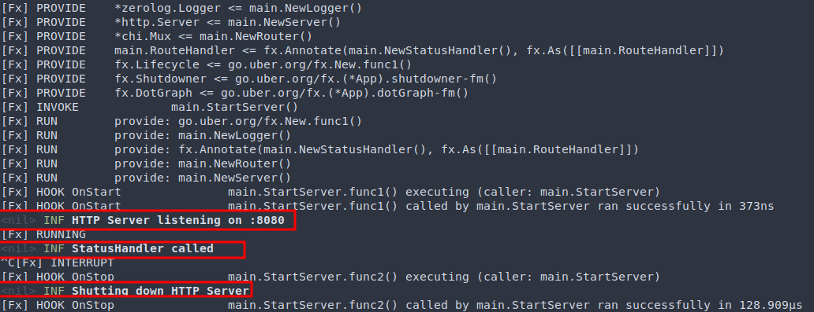

# Step 05: Add a logger

Now we want to be able to log information to know what's happening in our application.

## Documentation

In the `logger.go` file, you'll find a new function to create a new logger.

This logger can be used as follows:

```go
logger.Info().Msg("An info message")
logger.Warn().Msg("A warning message")
logger.Error().Msg("An error message")
```

## Tasks

1. Use the `NewLogger` function to provide a logger to the app
2. Use the logger to log information about the server starting and stopping
3. Use the logger to log information about the server receiving a status request

Now run your application and call the `/status` endpoint to see if the logger is working.

Our goal is to see something like this:




If you get the right output, you shall now proceed to the [next step](../step-06/README.md).